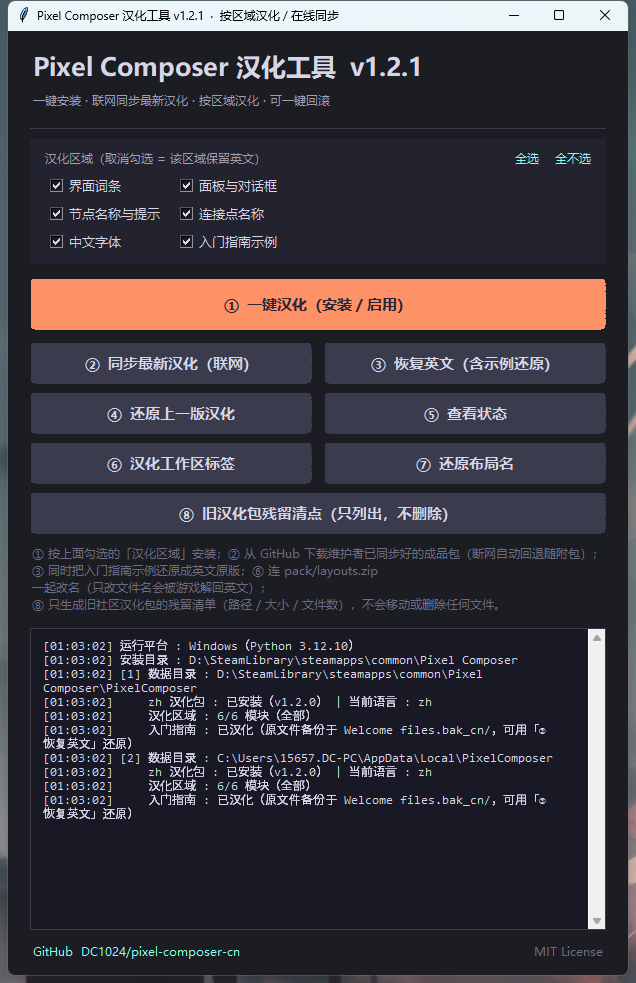
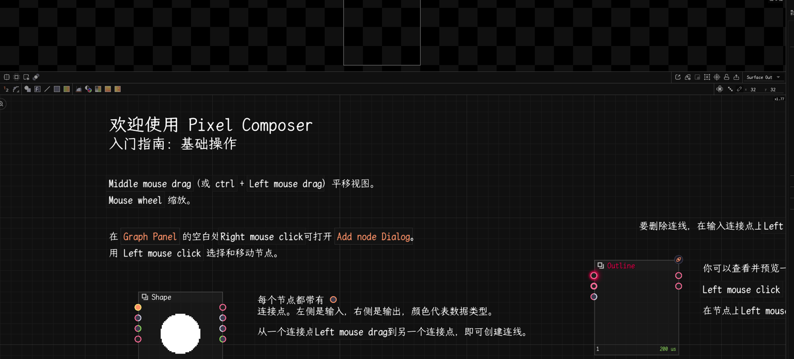

# Pixel Composer 中文汉化包
# Pixel Composer Chinese Localization

> 中英双语说明 · Bilingual README
> 适用于 Pixel Composer（https://pixel-composer.com/）的中文汉化方案：安装后即可离线使用，联网时可一键同步最新汉化。
> A Chinese localization for Pixel Composer — fully usable offline once installed, with one-click online sync to the latest pack.

---

## 简介 / Introduction

**中文** — 本仓库为 Pixel Composer 提供一套高质量**中文汉化**。汉化内容由维护者定期同步上游官方语言包，统一补翻、校正后发布到本仓库；客户端工具只负责**把成品包下载到本地并安装**，不在你的机器上跑翻译引擎。装好后完全离线可用；想拿最新汉化时点一下「② 同步最新汉化」即可，断网会自动回退到随附的汉化包。相比网上流传的旧汉化包，本方案覆盖率更高、可一键回滚、并能持续跟进官方更新。

**English** — This repo provides a high-quality **Chinese localization** for Pixel Composer. The maintainer periodically syncs the official upstream locale, retranslates and proofreads it, then publishes it here; the client tool only **downloads and installs the finished pack** — no translation engine runs on your machine. Once installed it works fully offline; click "② Sync latest" to pull updates, and it falls back to the bundled pack when offline. Compared with older community packs, it offers higher coverage, one-click rollback, and keeps up with official updates.

- 项目地址 / Repo: https://github.com/DC1024/pixel-composer-cn
- 官网（GitHub Pages）/ Website: https://dc1024.github.io/pixel-composer-cn/
- 许可证 / License: MIT

---

## 下载 / Download

| 方式 Option | 说明 Description |
|---|---|
| **一键汉化 EXE（Windows 推荐）** | [⬇ 下载 `PixelComposer-CN-Patcher.exe`（最新发行版）](https://github.com/DC1024/pixel-composer-cn/releases/latest/download/PixelComposer-CN-Patcher.exe) —— 免安装、免 Python，双击即用。 |
| **One-click EXE (Windows, recommended)** | [⬇ Download `PixelComposer-CN-Patcher.exe` (latest release)](https://github.com/DC1024/pixel-composer-cn/releases/latest/download/PixelComposer-CN-Patcher.exe) — portable, no Python, just double-click. |
| **Linux 一键包** | [⬇ 下载 `PixelComposer-CN-Linux.tar.gz`（最新发行版）](https://github.com/DC1024/pixel-composer-cn/releases/latest/download/PixelComposer-CN-Linux.tar.gz) —— 解压后 `./install.sh` 即可；只需要系统自带的 Python 3，不装任何依赖。 |
| **Linux bundle** | [⬇ Download `PixelComposer-CN-Linux.tar.gz` (latest release)](https://github.com/DC1024/pixel-composer-cn/releases/latest/download/PixelComposer-CN-Linux.tar.gz) — unpack and run `./install.sh`; only needs the system Python 3, no dependencies. |
| 源码 Source | 克隆本仓库后运行 `patch_tool.py` / `一键汉化.bat`（Windows）/ `install.sh`（Linux、macOS）。 Clone and run `patch_tool.py` / `一键汉化.bat` (Windows) / `install.sh` (Linux, macOS). |

> **EXE 只从 Releases 下载，仓库内不再存放**（两个约 18 MB 的构建产物每次发版都会进 git 历史，太浪费）。
> 想要二进制请点上面的链接：[最新发行版](https://github.com/DC1024/pixel-composer-cn/releases/latest)。
> **The EXE lives in Releases only** — the repo no longer tracks the ~18 MB build artifacts. Grab the binary from the [latest release](https://github.com/DC1024/pixel-composer-cn/releases/latest).

### 支持平台 / Supported platforms

| 平台 Platform | 状态 Status | 数据目录 Data root | 启动方式 Launch |
|---|---|---|---|
| **Windows** | ✅ 完整支持 / full | `%LOCALAPPDATA%\PixelComposer`（或被 `persistPreference.json` 重定向到游戏目录） | `PixelComposer.exe` |
| **Linux（原生 / SteamOS 版）** | ✅ 完整支持 / full | `$XDG_DATA_HOME/PixelComposer`（默认 `~/.local/share/PixelComposer`） | `launch.sh` |
| **Linux（Proton 跑 Windows 版）** | ✅ 自动识别 Proton 前缀 / auto-detected | `…/compatdata/2299510/pfx/drive_c/users/*/AppData/Local/PixelComposer` | Steam 启动项 |
| **macOS（Beta）** | ⚠️ 路径已适配、未实机验证 / paths handled, not hand-tested | `~/Library/Application Support/PixelComposer` | `PixelComposer/launch.sh` |

> Linux 上 `tkinter` 往往需要单独安装（Debian/Ubuntu `python3-tk`、Arch `tk`）。**没装也不影响使用** —— `install.sh` 会自动切到命令行界面，功能完全一致；想确认缺什么可以跑 `./install.sh deps`。
> On Linux `tkinter` often needs a separate package (`python3-tk` on Debian/Ubuntu, `tk` on Arch). **It's optional** — `install.sh` automatically falls back to the interactive CLI with identical functionality. Run `./install.sh deps` to see what's missing.



> 「入门指南」里的教程页也已汉化 —— 下面是游戏内实际效果（欢迎页 → 入门指南 → 基础操作）：
> The getting-started tutorial pages are localized too — here's how it looks in-game (Welcome → Getting started → Introduction):
>
> 

> **配色 / Palette**：EXE 界面与官网均取自 Pixel Composer 官方 `default` 主题（`Themes/default/values.json`）——背景 `#1c1c23`、面板 `#3b3b4e`、主强调色橙 `#ff9166`、文字 `#d6d6e8`。
> Both the GUI and the website use Pixel Composer's official `default` theme palette — bg `#1c1c23`, panel `#3b3b4e`, accent orange `#ff9166`, text `#d6d6e8`.

---

## 特性 / Features

| 特性 Feature | 说明 Description |
|---|---|
| 离线可用 Offline-ready | 随附完整 `zh` 汉化包，安装后全程无需联网；② 联网只是「取更新」，断网会自动回退随附包。 Ships with a complete `zh` pack — no network needed after install; ② only fetches updates and falls back to the bundled pack. |
| 持续更新 Actively synced | 维护者定期同步官方语言包 → 补翻校正 → 推送本仓库 → 客户端一键同步成品包，无需重装工具。 Maintainer syncs the official locale, retranslates, pushes; clients pull the finished pack in one click — no reinstall. |
| **按区域汉化 Per-area choice** | 六个区域可逐项勾选（界面词条 / 面板与对话框 / 节点 / 连接点 / 中文字体 / 入门指南示例），**默认全部汉化**；取消勾选 = 该区域保留官方英文，方便习惯英文的用户只汉化一部分。 Six toggleable areas (UI strings / panels & dialogs / nodes / junctions / CJK font / getting-started examples), **all on by default**; unticking keeps that area in official English. |
| **入门指南也汉化 Tutorials too** | 「入门指南」里的教程页与示例工程（`Getting started` / `Sample Projects` / `Templates`）说明文字已换成中文，原文件自动备份可一键还原。 The tutorial pages and sample projects under `Getting started` / `Sample Projects` / `Templates` are translated as well, with automatic backup and one-click revert. |
| **跨平台 Cross-platform** | Windows / Linux（原生 + SteamOS + Proton）完整支持，macOS 路径已适配。 Full support on Windows and Linux (native, SteamOS, Proton); macOS paths handled. |
| 一键 One-click | EXE / Linux 一键脚本 / 图形界面 / 命令行四种方式任选。 EXE, Linux `install.sh`, GUI, or CLI — your choice. |
| 配色一致 Themed | 界面配色与 Pixel Composer 官方主题一致。 GUI palette matches Pixel Composer's official theme. |
| 安全 Safe | 写入前自动备份原文件，支持「恢复英文」与「还原上一版」。 Auto-backup before writing; restore English or roll back. |
| 双目录 Dual-root | 自动同时写入 `LocalAppData` 与游戏目录，避免汉化"不生效"。 Writes to both data dirs so the language actually applies. |
| 残留清点 Leftover scan | 内置旧社区汉化包的**只读**残留清单（路径 / 大小 / 文件数），**只列不删**。 Built-in **read-only** inventory of old community-pack leftovers (paths / sizes / counts) — it never deletes. |
| 高覆盖 High coverage | 官方词条 1888 / 1916 已汉化（**98.5%**），另补 180 条官方未收录词条；节点约 93%；教程页 33 个全量。 See [覆盖率 / Coverage](#覆盖率-coverage). |

---

## 快速开始 / Quick Start

### 方式一：下载 EXE（推荐）/ Method 1: Download the EXE (recommended)
从 [Releases](https://github.com/DC1024/pixel-composer-cn/releases) 下载 [`PixelComposer-CN-Patcher.exe`](https://github.com/DC1024/pixel-composer-cn/releases/latest/download/PixelComposer-CN-Patcher.exe)，双击打开，点击「① 一键汉化」即可。免安装、无需 Python。
Download [`PixelComposer-CN-Patcher.exe`](https://github.com/DC1024/pixel-composer-cn/releases/latest/download/PixelComposer-CN-Patcher.exe) from [Releases](https://github.com/DC1024/pixel-composer-cn/releases), double-click, then click "① 一键汉化". Portable, no Python required.

### 方式二：一键批处理 / Method 2: One-click `.bat`
双击仓库内的 **`一键汉化.bat`**，按提示操作即可（需 Python 3.7+）。
Double-click **`一键汉化.bat`** in the repo (requires Python 3.7+).

### 方式三：图形界面 / Method 3: GUI
```bash
python patch_tool.py
```
会弹出一个窗口，点击「① 一键汉化」即可。
A window opens; click "① 一键汉化（安装/启用）".

### 方式四：Linux 一键脚本 / Method 4: Linux one-click script
```bash
tar -xzf PixelComposer-CN-Linux.tar.gz
cd PixelComposer-CN-Linux
./install.sh              # 有 tkinter 就开图形界面，没有就自动进命令行
./install.sh install      # 或者直接一键汉化
./install.sh status       # 看看探测到的游戏目录 / 数据目录
```
> 也可以从源码直接用：`git clone` 后 `./install.sh`。
> 游戏装在非默认位置时用 `PIXELCOMPOSER_DIR="/path/to/Pixel Composer" ./install.sh status` 指定。
> Or use it straight from the source tree: `git clone`, then `./install.sh`. For a non-default install location use `PIXELCOMPOSER_DIR="/path/to/Pixel Composer" ./install.sh status`.

### 方式五：命令行 / Method 5: Command line
```bash
python patch_tool.py --install
```
> 需要 Python 3.7+。若系统默认 `python` 不是 Python 3，请用 `py` 或 `python3`。
> Requires Python 3.7+. If `python` isn't Python 3, use `py` or `python3`.

完成后再**重启 Pixel Composer**，界面即为中文。
**Restart Pixel Composer** afterward — the UI will be in Chinese.

---

## 按区域汉化 / Per-area Localization

想只汉化一部分、其余保持英文（例如已经习惯英文的菜单名），勾选「汉化区域」里的对应项即可；**默认六项全选 = 全部汉化**。

Want only part of the game in Chinese (say you're used to the English node names)? Untick the areas you want to keep in English in the "汉化区域" panel — **all six are ticked by default**.

| 区域 Area | 覆盖内容 Covers |
|---|---|
| 界面词条 UI strings (`words`) | 菜单、工具栏、状态栏、设置项等词条 / menus, toolbars, status bar, settings |
| 面板与对话框 Panels & dialogs (`ui`) | 各类面板与弹窗正文 / panel and dialog bodies |
| 节点名称与提示 Nodes (`nodes`) | 节点名与说明 / node names and tooltips |
| 连接点名称 Junctions (`junctions`) | 输入/输出端口名 / input & output port names |
| 中文字体 CJK font (`fonts`) | 随包中文字体（**不选中文字体可能导致中文显示成方块**）/ bundled CJK font |
| 入门指南示例 Getting-started examples (`welcome`) | 教程页与示例工程里的说明文字 / tutorial prose and sample projects |

命令行等价写法 / CLI equivalent:
```bash
python patch_tool.py --install --modules words,ui      # 只汉化界面词条 + 面板对话框
python patch_tool.py --install --modules words,ui,nodes,junctions,fonts,welcome   # 全部（默认）
python patch_tool.py --list-modules                    # 列出可选区域
```

> **取消勾选 = 不安装该文件**，游戏会自己回退到内置英文 —— 不是往本地写一份英文副本。这样已安装的包始终与线上清单逐字节一致，下次「② 同步最新汉化」不会被误判成"文件变了"而重下。
> **Unticking an area simply doesn't install those files**; the game falls back to its built-in English. No English copies are written locally, so the installed pack stays byte-identical to the upstream manifest — otherwise every sync would think files had changed and re-download everything.

> 选择会记录在已安装的 `Locale/zh/manifest.json` 的 `selected` 字段里，所以「改了选择」不会被误判成「已是最新」。改完选择请重新点 ① 或 ② 应用。
> Your selection is recorded in the installed `Locale/zh/manifest.json` under `selected`, so changing it is never mistaken for "already up to date". Re-run ①/② to apply the change.

---

## 使用方法 / Usage

### 图形界面按钮 / GUI buttons
| 按钮 Button | 作用 Action |
|---|---|
| **汉化区域 checkboxes** | 六项可勾选，**默认全选**；取消勾选 = 该区域保留英文。应用时机为你点 ① 或 ② 时。 Six tickboxes, **all on by default**; unticking keeps that area English. Applied when you press ① or ②. |
| ① 一键汉化（安装/启用） Install & enable | 按上面勾选的区域安装并启用中文。 Install + enable Chinese using the ticked areas. |
| ② 同步最新汉化 Sync latest | **联网**从 GitHub 拉取维护者已翻好的最新汉化包并安装（只下载成品，本地不跑翻译引擎）；断网自动回退随附包。 Online: download and install the maintainer's latest finished pack from GitHub (no local engine); falls back to the bundled pack when offline. |
| ③ 恢复英文 Restore English | 切回英文，并把「入门指南」示例还原成官方英文原版。 Switch back to English and restore the getting-started examples to the official English originals. |
| ④ 还原上一版汉化 Rollback | 回滚到上一次安装的汉化包。 Roll back to the previously installed pack. |
| ⑤ 查看状态 Status | 显示安装目录、数据目录、包版本、当前语言与已选汉化区域。 Show install path, data roots, pack version, current language and selected areas. |
| ⑥ 汉化工作区标签 Localize layout tabs | 把自带布局改名为中文：**同时**改写 `layouts/*.json` 文件名与游戏自带 `pack/layouts.zip` 里的条目名（原 zip 备份为 `layouts.zip.bak_cn`）。 Renames the layout files **and** the entries inside the game's own `pack/layouts.zip` (the original zip is backed up as `layouts.zip.bak_cn`). |
| ⑦ 还原布局名 Restore layout names | 把布局文件名还原成英文。 Restore the original English layout file names. |
| ⑧ 旧汉化包残留清点 Leftover scan | **只列出**旧社区汉化包在安装目录里留下的东西（`zh/`、`Welcome files/A开始入门`、汉化 EXE、说明 txt…），带路径 / 大小 / 文件数。**不会移动或删除任何文件**。 **Lists only** what the old community pack left behind (`zh/`, `Welcome files/A开始入门`, its EXE and `.txt` docs…), with paths / sizes / file counts. **Nothing is moved or deleted.** |

> **②「同步最新汉化」到底做了什么？ / What does ② actually do?**
> 它**不在你的电脑上做翻译**，而是从 GitHub 下载一份**已经翻好的成品包**（`zh/`）。步骤是：① 依次尝试三个源拉取清单 `zh/manifest.json`（GitHub Pages → jsDelivr CDN → GitHub Raw）；② 用 sha256 比对本地已装的包，**只下载有变化的文件**（11 MB 的中文字体通常只在首次下载，之后每次一般只有几十 KB 的 json）；③ 备份现有 `zh` 后整包写入两个数据目录并保持中文。断网或源全部不可达时，会自动改用随附的汉化包，不会让汉化"变空"。若本地已是最新，会直接提示"无需更新"。
>
> 两个实现细节，第一次同步时会体会到：**① 每一段路径都做百分号编码** —— `welcome/**` 的路径里带空格（`Getting started/000 UI/…`），不编码三个源都取不到；**② 大文件（>2 MB，也就是那 11 MB 中文字体）优先走 CDN 而不是 Pages** —— 实测 Pages 对静态大文件限速明显（同一台机器 25 KB/s，而 jsDelivr 71 KB/s），且某个源失败时单个文件会自动换下一个源。整包 41 个文件首次同步实测约 5 分钟（11 MB 字体占大头），之后每次一般只有几十 KB。
>
> 另外还会**拒收版本低于本地已装的清单**：jsDelivr 对 `@main` 有较长缓存（实测推送后它还在返回上一版的清单），万一 Pages 临时不可达，这道闸能防止把已经装好的包降级。
>
> It does **not translate anything on your machine** — it downloads an **already-translated pack** (`zh/`) from GitHub. It fetches the manifest `zh/manifest.json` from three sources in order (GitHub Pages → jsDelivr CDN → GitHub Raw), compares sha256 against your installed pack, and **downloads only changed files** (the 11 MB CJK font is normally fetched once; later syncs are usually a few dozen KB of JSON). The existing `zh` is backed up before the whole pack is written to both data roots. If the network is unavailable, it falls back to the bundled pack instead of leaving you with nothing. If you're already current, it simply reports "nothing to update".
>
> Two details you'll notice on the first sync: **paths are percent-encoded** (the `welcome/**` paths contain spaces such as `Getting started/000 UI/…`, which no source serves unencoded), and **files over 2 MB — i.e. the 11 MB CJK font — prefer the CDN over Pages** (measured on one machine: 25 KB/s from Pages vs 71 KB/s from jsDelivr). Individual files also fail over to the next source automatically. A full 41-file first sync measured about 5 minutes (the 11 MB font dominates); later syncs are usually a few dozen KB.
>
> It also **refuses any manifest older than what you already have installed**: jsDelivr caches `@main` for a long time (measured still serving the previous version after a push), so this guard prevents a downgrade if Pages happens to be unreachable.

> **为什么这样设计 / Why it works this way**：翻译只在**维护者侧做一次**（同步上游官方语言包 → 补翻 → 统一校正 → 推送），而不是在每台用户机器上各跑一遍。好处是：结果统一、质量可控（可持续人工校对）、客户端不再需要携带翻译引擎、也避免了"每个用户翻出来的版本都不一样"。
>
> Translation happens **once, on the maintainer side** (sync the official locale → retranslate → proofread → push), not once per user machine. That means consistent results, quality you can keep improving by hand, no translation engine shipped to clients, and no divergence between users.

### 命令行参数 / Command-line flags
```text
--install           安装并启用中文（等价于 --no-gui）
--update / --sync   从 GitHub 同步最新汉化包并安装（断网回退随附包）
--restore           恢复英文（含入门指南示例还原）
--rollback          还原上一版汉化
--status            查看当前状态（平台 / 目录 / 包版本 / 已选区域）
--leftovers         旧汉化包残留清点（只列出，不删除）
--layouts           汉化工作区标签（重命名布局文件）
--layouts-restore   还原布局文件名
--modules <列表>    只汉化指定区域，逗号分隔（words,ui,nodes,junctions,fonts,welcome）
--install-dir <路径> 手动指定游戏安装目录（优先级高于自动探测）
--list-modules      列出可选汉化区域
--version / -V      打印工具版本
--no-gui            无界面直接安装（用于脚本/自动化）
--cli               强制进入交互式命令行
```
示例 / Examples:
```bash
python patch_tool.py --sync              # 同步最新汉化包
python patch_tool.py --status            # 查看状态
python patch_tool.py --install --modules words,nodes   # 只汉化界面词条 + 节点
python patch_tool.py --leftovers         # 旧汉化包残留清单（只读）
python patch_tool.py --layouts           # 工作区标签改中文
python patch_tool.py --no-gui            # 脚本中静默安装
```

环境变量 / Environment variables:
```bash
PIXELCOMPOSER_DIR="/path/to/Pixel Composer"   # 手动指定游戏安装目录 / force install dir
STEAM_ROOT="/path/to/Steam"                   # 手动指定 Steam 根目录 / force Steam root
PCCN_SOURCE=https://my-mirror.example.com/pixel-composer-cn   # 自定义同步源（镜像）
```

> `PCCN_SOURCE` 可填仓库地址或 `zh/` 目录地址，会被排到三个默认源之前优先尝试。
> `PCCN_SOURCE` may point at the repo or the `zh/` directory and is tried before the three default sources.

---

## 更新机制 / How Updates Work

**翻译只在维护者侧做一次，客户端只下载成品包。**
Translation happens **once, on the maintainer side**; the client only downloads the finished pack.

```text
游戏自带 pack/locale.zip（官方 en 基准） + Locale/version
        │  ① 维护者：定期同步上游
        ▼
build/sync_upstream.py    抽取 en → 补翻新增/残留条目 → 注入补充表 → 写 zh/
        │  ② 生成 zh/manifest.json（版本号 / sha256 清单）
        ▼
git push origin main      →  GitHub（Raw / Pages / jsDelivr 三个下载源）
        │  ③ 客户端：一键同步
        ▼
「② 同步最新汉化」        拉清单 → 比对 sha256 → 只下载变化的文件 → 备份后安装
```

| 角色 Role | 做什么 What it does |
|---|---|
| **上游 Upstream** | 游戏自带的 `pack/locale.zip` 与 `Locale/version`。游戏一更新，官方词条与版本号就会变，维护者脚本据此感知。 The game's own `pack/locale.zip` + `Locale/version`; a game update changes them, which the maintainer script detects. |
| **维护者 Maintainer** | 运行 `python build/sync_upstream.py --push`：抽取官方 `en` 基准 → 补翻新增/残留词条 → 注入补充表 → 写 `zh/` 与 `zh/manifest.json` → 提交推送。 Runs `build/sync_upstream.py --push`: extracts the official `en` baseline, retranslates new/leftover entries, injects the extra tables, writes `zh/` + `zh/manifest.json`, then commits and pushes. |
| **客户端 Client** | 点「② 同步最新汉化」（或 `--sync`）：拉清单 → 按文件哈希比对 → 只下载有变化的文件 → 备份现有 `zh` 后整包安装。**本地不跑翻译引擎。** Clicks "② Sync latest" (or `--sync`): fetches the manifest, compares per-file hashes, downloads only changed files, backs up the current `zh`, installs the pack. **No engine runs locally.** |

汉化包版本记录在 `zh/manifest.json` 的 `version` 字段，随包一起下发；「⑤ 查看状态」会显示当前安装的包版本。若某源不可用，会自动换下一个源（可用环境变量 `PCCN_SOURCE` 指定镜像）。
The pack version lives in `zh/manifest.json` (`version`) and travels with the pack; "⑤ Status" shows which version is installed. If a source is unavailable it falls back to the next one (set `PCCN_SOURCE` to use a mirror).

### 维护者侧：每月自动同步上游 / Monthly automated upstream sync

维护者机器（装有 Pixel Composer 的那台）可以注册一个每月任务，让「同步上游」全自动：
AI on the maintainer's machine (the one with Pixel Composer installed) can register a monthly task so upstream syncing is hands-off:

```bat
powershell -ExecutionPolicy Bypass -File build\install_sync_task.ps1
rem 默认每月 1 号 09:00；-Frequency monthly -DayOfMonth 15 -Time 09:00 可改日期
rem -Frequency weekly -Day MON -Time 09:00 也可改回每周；-Uninstall 卸载
rem Default: 1st of each month at 09:00. Tweak with -Frequency/-DayOfMonth/-Time; -Uninstall to remove
```

两项约定已固化 / Two conventions now baked in：

- **版本号跟上游**：`Locale/version` 前进时，汉化包版本自动 patch +1（`1.2.0 → 1.2.1`）。注意汉化包版本 ≠ 工具版本（`patch_tool.py` 的 `VERSION`）。The pack version auto-bumps when upstream `Locale/version` advances; note it differs from the tool version (`patch_tool.py`'s `VERSION`).
- **翻不出来的条目不写 "TODO"**：拿不准的条目在该 key 上保持**英文回退**（界面显示英文原文，绝不会冒出 "TODO" 字串），同时列进 `build/todo_report.md` 供人工补录。永久修正请加进 `translate_core.LOCALE_OVERRIDE`，后续同步会自动继承。Untranslated entries stay as **English fallback** (the UI shows the original English — never a literal "TODO") and are listed in `build/todo_report.md` for you to fill in. Fix them permanently in `translate_core.LOCALE_OVERRIDE`; later syncs inherit those.

⚠️ **自动同步覆盖不到的部分**：官方 `pack/locale.zip` 的 `en/` 里只有 `words.json` / `nodes.json` / `junctions.json` / `config.json` / `notes/*.md`，**没有 `UI.json`** —— 面板与对话框词条不在官方语言包里，因此 `zh/UI.json` 无法跟随上游自动同步，需要单独维护。What upstream automation cannot reach: the shipped `en/` folder contains no `UI.json`, so panel/dialog strings (`zh/UI.json`) must be maintained separately.

---

## 覆盖率 / Coverage

| 文件 File | 条目 Entries | 内容 Content |
|---|---|---|
| `words.json` | **2096** | 词条 / 标签 / 菜单项。官方 `en` 的 1916 条中已汉化 **1888** 条（**98.5%**），另额外补充 180 条官方未收录词条。 |
| `UI.json` | 560 | 界面文本 / UI strings |
| `nodes.json` | 942 | 节点名称 / node names（约 93%） |
| `junctions.json` | 3 | 连接点 / junctions |
| `welcome/**` | **33** | 入门指南教程页与示例工程（`.pxc` 内的 351 处说明文字，对照表 302 条全部命中、零遗漏）。 Getting-started tutorial pages & sample projects — 351 prose strings inside the `.pxc` files, fully covered by a 302-entry table. |
| `config.json` / `fonts/` | 已含 / included | 配置与随包中文字体 / config & bundled CJK fonts |

> 说明 / Note：剩余未翻译的词条多为品牌名、格式名或专有名词（如 `CMYK`、`OKLAB`、`PXC`、`ORA`、`Aseprite`、`ShaderToy`、`Bluesky` 等），按约定保留英文，以避免歧义。
> The few untranslated entries are intentional English keeps — brand/format/proper nouns (e.g. `CMYK`, `OKLAB`, `PXC`, `ORA`, `Aseprite`, `ShaderToy`, `Bluesky`) kept as-is to avoid ambiguity.

---

## 工作原理 / How It Works

**中文** — Pixel Composer 采用 **Locale 覆盖机制**（而非修改二进制）：程序会从 `Locale/{语言}/` 读取 `words.json`、`nodes.json`、`UI.json`、`junctions.json`、`config.json`、`fonts/`、`notes/` 等文件，`en` 作为兜底语言最先加载。本工具把预翻好的 `zh` 包写入该目录，并把语言开关 `preferences/1171/keys.json` 中的 `local` 改为 `"zh"`。`Locale/zh/` 里还会多一个 `manifest.json`（版本号 + 各文件 sha256 清单），供同步功能比对版本用；游戏只按上述固定文件名加载，多这一个 JSON 对游戏没有影响。

由于该游戏的 `persistPreference.json` 在 `LocalAppData` 与游戏目录之间互相指向，工具会**同时写入两个数据目录**并确保两处的 `keys.json` 都设为 `zh`，从而保证汉化稳定生效。

**English** — Pixel Composer uses a **Locale overlay** (not binary patching): it reads `words.json`, `nodes.json`, `UI.json`, `junctions.json`, `config.json`, `fonts/`, `notes/` from `Locale/{lang}/`, with `en` loaded first as a fallback. This tool drops the pre-translated `zh` pack into that folder and flips the language switch in `preferences/1171/keys.json` (`local` → `"zh"`). `Locale/zh/` additionally carries a `manifest.json` (version + per-file sha256) used by the sync feature to compare versions; the game loads only the fixed file names above, so the extra JSON has no effect on it.

Because the game's `persistPreference.json` points circularly between `LocalAppData` and the game directory, the tool **writes to both data roots** and sets `zh` in each `keys.json`, so the localization reliably applies.

```
LocalAppData/PixelComposer/Locale/zh/...      ← 写入点 1 / root 1
游戏目录/PixelComposer/Locale/zh/...           ← 写入点 2 / root 2
两处 preferences/1171/keys.json 均设 local="zh"
```

---

## 已知限制 / Known Limitations

| 位置 Where | 情况 Status | 处理 Workaround |
|---|---|---|
| **浮动面板标题**（`Toolbar`、`Collections` 等） | 这些标题由主程序内部维护的**面板注册表**直接绘制，**不走语言包**。已实测 20 余种候选键名（`panel_toolbar`、`panel_collections`、`Toolbar Panel`、原始字符串 `Toolbar` / `Collections` 等）全部无效。 | 无需处理：**打开面板的入口在「面板菜单」里，条目已全部汉化**（显示为「工具栏」「集合」「图表」等），不影响日常使用。 |
| **工作区布局标签**（`Horizontal` / `Vertical` / `Preview` / `Drawing` / `Side menu`） | 标签显示的是 `layouts/*.json` 的**文件名**，本身不查语言表（已确认布局名不存在于任何语言包或偏好设置中，程序按目录枚举文件）。⚠️ 只改文件名**会被还原**：实测改完名启动一次，游戏就从 `pack/layouts.zip` 把 5 个英文名重新解了出来，变成中英两套重复标签。 | 点 **⑥ 汉化工作区标签** —— 它会**同时改写 `pack/layouts.zip` 里的条目名**（原 zip 备份为 `layouts.zip.bak_cn`），改完启动实测**只剩中文名、英文名不再回来**；不满意点 **⑦ 还原布局名**。注意：执行 ⑥ 会触发游戏按 zip 重新解出一次内置布局，若你改过这 5 个内置布局的内容会被还原（你自建的布局不受影响）；`__default.json` 与 `layouts/version` 永不被改动。 |
| **内置参考文档 `notes/`**（`Blend modes reference` / `Lindenmayer system reference` / `MK Panels reference`） | 这三篇是带专用排版标记（`{g}`、`<x20>`、`<x128>` 等）的 Markdown 参考文档，官方语言包中只有英文版，当前**未翻译**（游戏会回退显示英文原文）。 | 待补。翻译它们需要保留排版标记，属于独立的校对工作；需要的话可提 Issue。 |
| **入门指南卡片标题**（`Introduction`、`Node Shortcuts`…） | 欢迎页上每张卡的标题取的是 `Welcome files/**/*.pxc` 的**文件名**（去掉数字前缀），程序不查任何语言表 —— 所以**卡片标题保持英文**，但点进去以后**页面里的说明文字是中文**（已实机验证）。 | 这是有意为之：本方案按**同名覆盖**（文件名保持英文），不会出现中英两套重复卡片，也不会破坏 Steam 自动更新；想要中文文件名可提 Issue。 |
| `2d` / `3d` / `CMYK` / `OKLAB` / `PXC` 等 | 品牌名 / 格式名 / 专有名词。 | 按约定保留英文，避免歧义。 |
| **Linux 图形界面** | `tkinter` 通常不在系统 Python 里（Debian/Ubuntu 要 `python3-tk`，Arch 要 `tk`）；SteamOS / Steam Deck 根分区只读，装不上。 | 不用管：`install.sh` 会自动切到命令行界面，**功能完全一致**（六个区域、同步、还原、清点都在）。`./install.sh deps` 可查缺什么。 |

**English** — Floating panel titles (`Toolbar`, `Collections`, …) are drawn by the executable's internal panel registry and **never pass through the locale tables** — 20+ candidate key forms were tested and none had any effect. The panel *menu* entries (the way you actually open these panels) are fully translated, so this is cosmetic. Workspace layout tabs show `layouts/*.json` **file names**, which the locale tables cannot touch — use button ⑥ to rename them (⑦ reverts); `__default.json` and `layouts/version` are never modified. The three built-in reference documents under `notes/` are Markdown files using a custom layout markup (`{g}`, `<x20>`, …) and ship in English only — they are **not translated yet** and fall back to English. Getting-started **card titles** come from the `.pxc` **file names** (numeric prefix stripped) and never pass through a locale table, so titles stay English while the tutorial page you open is fully Chinese — verified in-game. This is intentional: the pack overwrites same-named files, so you never get a duplicated English/Chinese card set and Steam updates keep working. On Linux, `tkinter` is often missing (`python3-tk` on Debian/Ubuntu, `tk` on Arch) and SteamOS has a read-only root — `install.sh` then falls back to an interactive CLI with identical functionality.

---

## 与旧社区汉化包的区别 / vs. Old Community Pack

| 对比项 / Aspect | 旧社区汉化包 Old pack | 本方案 This project |
|---|---|---|
| 安装方式 Install | 手动把 `zh/` 与 `Welcome files/` 复制进游戏根目录，教程整包换成中文名文件夹 | 一键安装到正确的数据目录（自动双写），教程按同名覆盖 |
| 更新速度 Updates | 慢，依赖作者手动发布 / slow, manual | 维护者定期同步上游，客户端一键取最新包 / maintainer syncs upstream, clients pull in one click |
| 覆盖率 Coverage | 较低 / lower | 词条 98.5%（1888/1916）· 节点 ~93% · 教程页 33/33 |
| 联网需求 Network | 常需联网取包 / often online | 装好后离线可用；② 联网只取更新，断网自动回退 / offline-ready; ② only fetches updates and falls back offline |
| 可回滚 Rollback | 通常不支持 / usually no | 备份 + 一键回滚 / backup + one-click rollback |
| 双目录 Dual-root | 易漏写导致不生效 / easy to miss | 自动双写 / auto dual-write |
| 按区域汉化 Per-area | 不支持 / no | 六个区域可勾选，默认全选 / six tickboxes, all on by default |
| 跨平台 Platforms | 只有 Windows / Windows only | Windows + Linux（原生/SteamOS/Proton），macOS 路径已适配 / Windows + Linux (native, SteamOS, Proton), macOS paths handled |
| 残留处理 Leftovers | — | 内置**只读**清单（⑧），**只列不删** / built-in **read-only** inventory (⑧), never deletes |

### 装过旧社区汉化包？/ Already used the old community pack?

旧包是「把 `zh/` 和 `Welcome files/` 丢进游戏根目录」，装过之后这些文件会一直留在那里，既占空间也可能让欢迎页多出一组重复的中文卡片。本工具**不会自动删除它们**（避免误删你自己的东西），但提供了只读清点：

```bash
python patch_tool.py --leftovers        # 或点界面上的 ⑧
```

它会列出每一项的路径、大小和文件数（实测在一台装过旧包的机器上是 10 项 / 约 32.7 MB，含旧包自己的 13.6 MB 汉化 EXE、安装根目录下的 `zh/`、`Welcome files/A开始入门|B示例项目|C模板` 以及两个说明 txt）。**确认不需要后请自行手动删除。**

The old pack simply drops `zh/` and `Welcome files/` into the game's install root; those stay behind forever and can add a duplicate set of Chinese cards to the welcome page. This tool **never deletes them for you**, but it does offer a read-only inventory (button ⑧ / `--leftovers`) listing each item's path, size and file count. **Delete them yourself once you're sure.**

---

## 打包发行 / Packaging

### Windows EXE
需要 Python 3.7+（含 tkinter）。双击运行 **`build_exe.bat`**，脚本会自动安装 PyInstaller、把 `zh/` 汉化包与同步模块内嵌进程序，产出单文件 **`PixelComposer一键汉化.exe`**（免安装、双击即用）。产物已被 `.gitignore` 忽略，不会进版本库 —— 正式发行请上传到 GitHub Releases。

Requires Python 3.7+ (with tkinter). Double-click **`build_exe.bat`**; it installs PyInstaller, embeds the `zh/` pack + sync module, and produces a single-file **`PixelComposer一键汉化.exe`**. The artifact is git-ignored on purpose — publish it as a GitHub Release instead of committing it.

等价的命令行 / Equivalent CLI:
```bash
pip install pyinstaller
pyinstaller --onefile --windowed --name PixelComposer-CN-Patcher \
  --icon app_icon.ico --add-data "zh;zh" --add-data "app_icon.ico;." \
  --add-data "translate_core.py;." --add-data "zhsync.py;." \
  --hidden-import translate_core --hidden-import zhsync patch_tool.py
```

> ⚠️ 如果你给 PyInstaller 传了 `--specpath`，`--add-data` / `--icon` **必须改用绝对路径** —— PyInstaller 以 spec 文件所在目录为基准解析相对路径，否则会报 `Unable to find ...\spec\zh`。
> If you pass `--specpath`, make `--add-data` / `--icon` **absolute** — PyInstaller resolves relative paths against the spec directory, otherwise it fails with `Unable to find ...\spec\zh`.

图标由 `build/make_icon.py` 生成（配色取自 Pixel Composer 官方主题）。
The icon is generated by `build/make_icon.py` (colors from Pixel Composer's official theme).

### Linux 发行包
Linux 版不需要编译 —— 直接打包源码即可（纯标准库，无二进制依赖）：

```bash
bash build_linux.sh          # 产出 PixelComposer-CN-Linux.tar.gz
```

包内结构 / Contents:
```text
PixelComposer-CN-Linux/
├── install.sh          # 一键脚本（可执行位已设好）
├── patch_tool.py       # 主程序（标准库 only）
├── zhsync.py           # 在线同步模块
├── translate_core.py   # 被 patch_tool 引用（保留兼容）
├── README.md           # 本说明
├── LICENSE
└── zh/                 # 完整汉化包（44 个文件，含 welcome/ 教程与 fonts/ 中文字体）
```

> 字体是「装完即可离线使用」的前提，所以默认打进包里；少了它界面里的中文会变成方块。
> The CJK font is bundled because that's what makes the pack fully offline-usable; without it Chinese renders as boxes.

---

## 贡献 / Contribute

翻译引擎与源数据位于 `build/` 目录（**引擎只用于维护者侧生成汉化包，客户端不运行**）：

- `build/translate_core.py` — 翻译引擎（短语表 + 词条表 + 规则组合）。
- `build/sync_upstream.py` — **维护者主脚本**：同步上游官方语言包 → 补翻 → 更新 `zh/` 与 `zh/manifest.json`（`--push` 可自动提交推送）。
- `build/pxc.py` — `.pxc` 工程容器编解码（`PXCX` 文件头 + `THMB`/`META` 分块 + zlib 主数据），用于改教程文字而不破坏工程。
- `build/welcome_zh.json` — 入门指南说明文字的英中对照表（302 条）。
- `build/translate_welcome.py` — **入门指南汉化脚本**：从官方 `pack/welcome_files.zip` 抽取教程 → 替换文本节点 → 写 `zh/welcome/`；内置标签多重集自检（`<node …>` / `<bt …>` 是查找键，翻错会导致游戏找不到图标，脚本会直接拒绝生成）。
- `zhsync.py` — **客户端同步模块**：拉清单、比对 sha256、按需下载并安装（`patch_tool.py` 的 ② 即调用它）。
- `build/en_*.json` — 从游戏原始 `en` 语言包抽取的源数据。
- `build/zh_*_seed.json` — 人工校对的中文种子。
- `build/build_locale.py` / `build/analyze.py` — 构建与分析脚本。
- `build/retranslate_leftovers.py` — 补翻残留英文条目。

入门指南的说明文字改起来是这样两步：

```bash
# 1) 改对照表 build/welcome_zh.json（键=英文原文，值=中文；<bt …> 这类标签必须原样保留）
# 2) 重新生成 + 重建清单
python build/translate_welcome.py --manifest --version 1.2.1
```

如需补充翻译，可直接编辑 `zh/words.json` / `zh/nodes.json` —— **手工修正基本不会被自动覆盖**：补翻逻辑只在「该条目的中文值仍等于英文原文」时才重新翻译，已有中文值一律跳过（例外：`translate_core.py` 里 `LOCALE_OVERRIDE` 列出的键是工具刻意纠正项，会强制覆盖）。改完运行 `python build/sync_upstream.py --force --version <新版号>` 重新生成清单并推送。

To improve translations, edit `zh/words.json` / `zh/nodes.json` directly — **manual fixes are generally not overwritten** (the re-translate step only touches entries whose value still equals the English original; exceptions are the keys listed in `LOCALE_OVERRIDE`, which the tool intentionally forces). Then run `python build/sync_upstream.py --force --version <new>` to regenerate the manifest and push.

---

## 许可证 / License

[MIT](LICENSE) © DC1024

你可以自由使用、修改、再分发本汉化包；但 Pixel Composer 本身 © 其原作者，请遵守其许可。
Free to use, modify, and redistribute. Pixel Composer itself © its original author — respect its license.
